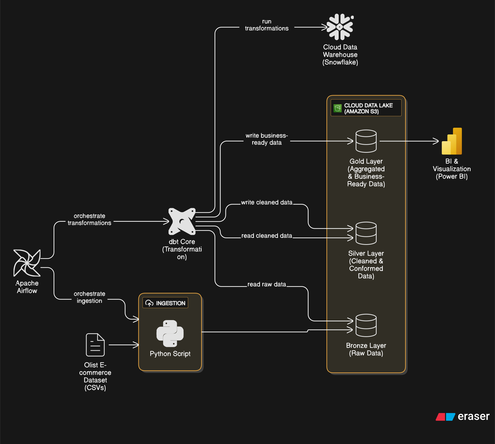

# The E-commerce Medallion Lakehouse: A Blueprint for a Snowflake-Powered Data Platform

This repository contains a complete, production-grade data engineering project that builds an ELT pipeline for the Olist E-commerce dataset. It demonstrates a modern data stack, implementing a Medallion Lakehouse architecture to ingest raw data, transform it through quality-gated layers, and serve it in an analytics-ready format for business intelligence.

---

## 📚 Table of Contents

1. [Architectural Overview](-#architectural-overview)

2. [Technology Stack](-#-technology-stack)

3. [Project Structure](-#project-structure)

4. [Setup and Installation](-#setup-and-installation)

5. [Step 1: Prerequisites](#step-1-prerequisites)

6. [Step 2: Cloud Infrastructure Setup (AWS & Snowflake)](#step-2-cloud-infrastructure-setup-aws--snowflake)

7. [Step 3: dbt Cloud Configuration](#step-3-dbt-cloud-configuration)

8. [Step 4: Airflow Orchestration Setup](#step-4-airflow-orchestration-setup)

9. [Running the Pipeline](#running-the-pipeline)

10. [Future Enhancements](#future-enhancements)

---

## Architectural Overview
This project is built on a modern Lakehouse Architecture, which combines the cost-effective storage of a data lake with the performance and governance of a data warehouse. Data flows through a Medallion Architecture, ensuring quality and traceability across three distinct layers :

Bronze Layer: Raw, immutable data is ingested from source systems into an Amazon S3 data lake.

Silver Layer: Data is cleaned, conformed, and enriched in Snowflake, creating a validated "single source of truth."

Gold Layer: Data is aggregated into business-specific data marts, modeled as a star schema, and optimized for analytics.



## Technology Stack

*   **Cloud Provider**: Amazon Web Services (AWS)
*   **Data Lake Storage**: Amazon S3
*   **Data Warehouse**: Snowflake
*   **Data Transformation**: dbt Cloud
*   **Workflow Orchestration**: Apache Airflow (via Astro CLI)
*   **Data Ingestion**: Python (`boto3`, `pandas`)
*   **Business Intelligence**: Tableau

## Project Structure

The repository is organized into two main components: the `dbt_project` for transformations and the `airflow_project` for orchestration.

## Setup and Installation

Follow these steps to set up and run the project on your local machine.

### Step 1: Prerequisites

Ensure you have the following tools installed:
1.  **Git**: For cloning the repository.
2.  **Python & Pip**: For running the ingestion script.
3.  **Docker Desktop**: Required to run Airflow locally.
4.  **Astro CLI**: The command-line tool for running Airflow.
    ```bash
    brew install astro
    ```

### Step 2: Cloud Infrastructure Setup (AWS & Snowflake)

1.  **AWS Account & S3 Bucket**:
    *   Create a free AWS account .
    *   Create an S3 bucket to serve as your data lake.
    *   Create an IAM user with programmatic access and `AmazonS3FullAccess` permissions. Note your `Access Key ID` and `Secret Access Key`.

2.  **Snowflake Account**:
    *   Sign up for a 30-day free trial of Snowflake . Choose AWS as the cloud provider and the same region as your S3 bucket.
    *   In a Snowflake worksheet, run the SQL commands to create the necessary databases, schemas, and warehouses as outlined in the project report.

3.  **Connect Snowflake to S3**:
    *   Follow the steps in the project report to create a `FILE FORMAT`, `STORAGE INTEGRATION`, `EXTERNAL STAGE`, and `EXTERNAL TABLES` in Snowflake. This allows Snowflake to read data directly from your S3 bucket.

### Step 3: dbt Cloud Configuration

1.  **Create a dbt Cloud Project**:
    *   Sign up for a free dbt Cloud Developer account .
    *   Create a new project and connect it to your Snowflake data warehouse .
    *   Connect the dbt Cloud project to your forked version of this GitHub repository.

2.  **Create a Deployment Job**:
    *   In dbt Cloud, set up a new deployment environment .
    *   Create a new **Deploy Job** .
    *   In the "Execution Settings," add a single command: `dbt build`.
    *   Under "Triggers," **uncheck** the "Run on Schedule" box. Airflow will be our scheduler .
    *   Save the job and note the **Job ID** from the URL.

### Step 4: Airflow Orchestration Setup

1.  **Initialize Airflow Project**:
    *   Navigate to the `airflow_project` directory in your local repository.
    *   Start the local Airflow environment using the Astro CLI:
        ```bash
        astro dev start
        ```
    *   This will spin up several Docker containers. Access the Airflow UI at `http://localhost:8880` (login: `admin`/`admin`).

2.  **Connect Airflow to dbt Cloud**:
    *   In dbt Cloud, generate a **Service Account Token** with "Job Admin" permissions .
    *   In the Airflow UI, navigate to **Admin -> Connections** and create a new connection .
    *   Set the connection type to `dbt Cloud` and fill in the details:
        *   **Connection Id**: `dbt_cloud_default`
        *   **API Token**: Your dbt Cloud service token.
        *   **Account ID**: Your dbt Cloud account ID.

## Running the Pipeline

1.  **Ingest Raw Data**:
    *   First, run the Python script to upload the Olist CSV files from your local machine to the S3 bucket's bronze layer.
    *   Navigate to the `ingestion/` directory and run:
        ```bash
        python s3_ingestion.py
        ```

2.  **Trigger the Airflow DAG**:
    *   In the Airflow UI (`http://localhost:8880`), find the DAG named `dbt_cloud_olist_pipeline`.
    *   Unpause the DAG using the toggle on the left.
    *   Click the "Play" button on the right to trigger a manual run. This will make an API call to dbt Cloud, which will execute the `dbt build` command on your project.

3.  **Verify the Results**:
    *   You can monitor the job's progress in the dbt Cloud UI.
    *   Once the run is complete, query the `dim_customers` and `fct_orders` tables in your Snowflake `ANALYTICS_GOLD` schema to see the final, transformed data.

## Future Enhancements

This project provides a solid foundation that can be extended with more advanced features:

*   **Incremental Models**: Convert the `fct_orders` model to an incremental model to optimize performance and reduce costs on subsequent runs.
*   **CI/CD Integration**: Use dbt Cloud's built-in CI/CD features or GitHub Actions to automatically test and deploy changes on pull requests.
*   **Advanced Data Quality**: Incorporate packages like `dbt-expectations` for more comprehensive and expressive data quality testing.
*   **Data Visualization**: Connect a BI tool like Tableau to the Gold layer tables in Snowflake to build an executive dashboard.