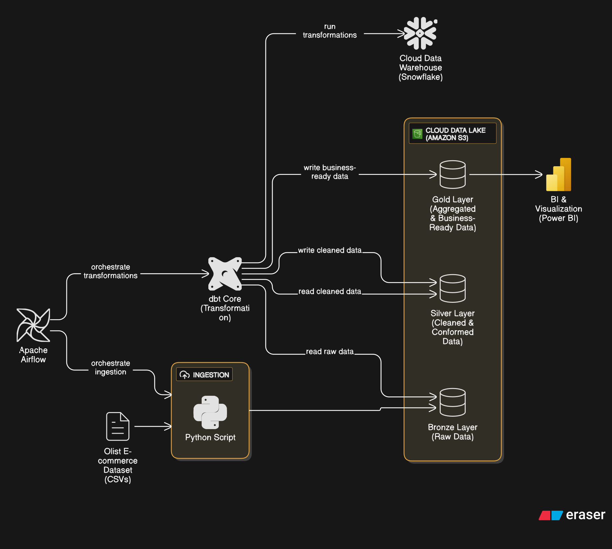

# The E-commerce Medallion Lakehouse: Brazilian Market Intelligence

This repository demonstrates a production-grade ELT pipeline and Medallion Lakehouse architecture built on Snowflake, dbt, and Airflow. It transforms raw, fragmented e-commerce data into a high-performance analytical engine.

---
## Architectural Overview
This project is built on a modern Lakehouse Architecture, which combines the cost-effective storage of a data lake with the performance and governance of a data warehouse. Data flows through a Medallion Architecture, ensuring quality and traceability across three distinct layers:

Bronze Layer: Raw, immutable data is ingested from source systems into an Amazon S3 data lake.
Silver Layer: Data is cleaned, conformed, and enriched in Snowflake, creating a validated "single source of truth."
Gold Layer: Data is aggregated into business-specific data marts, modeled as a star schema, and optimized for analytics.


---


## 1. The Problem
Modern e-commerce platforms like Olist generate millions of events across disparate datasets (orders, payments, reviews, and logistics). Decision-makers face three primary hurdles:
1. **Data Fragmentation:** Payment details are at a different grain than order headers.
2. **Schema Drift:** Raw CSV/JSON files lack strict typing, leading to downstream failure.
3. **Low Trust:** Business logic violations (e.g., an order being delivered before it was purchased) often go undetected until they hit a dashboard.

## 2. Project Scope & Dataset
This project utilizes the **Brazilian E-commerce Public Dataset by Olist**.
- **Scale:** 100k orders from 2016 to 2018.
- **Complexity:** Multi-dimensional data including geolocation, customer demographics, and product category translations.
- **Goal:** Create a 360-degree view of the customer and a robust Order Fact table to drive growth metrics (AOV, CLV, Retention).

## 3. Use Case: Analytical Star Schema
The final output is an **Analytics Gold Layer** modeled as a Star Schema:
- **`fct_orders`:** A consolidated fact table containing order status, timing, and aggregated financial metrics (Price + Freight).
- **`dim_customers`:** A standardized dimension table tracking customer locations and unique identifiers.
- **Pivoted Metrics:** Financial data is dynamically pivoted at the intermediate layer to provide a flat view of payment methods per order.

## 4. Tech Stack & Justification
| Technology | Choice Justification |
| :--- | :--- |
| **Snowflake** | Serves as the compute and storage engine. Chosen for its native support for semi-structured data and elastic scaling for ELT workloads. |
| **dbt (Data Build Tool)** | Handles the "T" in ELT. Used for version-controlled SQL, automated documentation, and modular testing. |
| **Terraform** | Implements Infrastructure as Code (IaC) to ensure the Snowflake environment (databases, roles, warehouses) is repeatable and secure. |
| **AWS S3** | Serves as the Bronze (Raw) storage layer, providing highly available and cost-effective object storage. |
| **Apache Airflow** | Orchestrates the end-to-end flow, managing dependencies between Python ingestion scripts and dbt Cloud jobs. |

## 5. Data Exploration & Assessment
Initial assessment revealed significant challenges in the raw data:
- **Semi-structured Blobs:** Raw data was ingested as `VARIANT` types in Snowflake.
- **Inconsistent Grain:** The `order_items` dataset had multiple rows per `order_id`, while `order_payments` could have multiple payment sequences for a single transaction.
- **Categorical Mismatches:** Product categories were in Portuguese, requiring a translation join in the Silver layer.

## 6. Data Quality Strategy
To ensure a "Single Source of Truth," I implemented a three-tier quality gate:

### Tier 1: Schema Enforcement (Silver Layer)
Every staging model (e.g., `stg_olist_orders`) utilizes explicit casting and column renaming. This prevents "silent failures" where a source change breaks downstream logic.

### Tier 2: Generic Testing
Using `dbt-expectations`, I enforced:
- **Uniqueness & Non-Null:** Ensuring `order_id` is a valid Primary Key.
- **Referential Integrity:** Ensuring every order in the Fact table exists in the Customer Dimension.
- **Range Validation:** Enforcing that `payment_value` is never negative.

### Tier 3: Custom Logic (Singular Tests)
Implemented a "Chronological Integrity" test (`assert_delivered_date_is_after_purchase_date.sql`) to catch data anomalies where logistics systems reported delivery before the purchase was finalized.

## 7. Pipeline Execution & DevOps
The project follows a modern DataOps workflow:
1. **IaC:** Terraform provisions the Snowflake environment.
2. **Ingestion:** Python scripts move data to S3.
3. **Transformation:** dbt builds the Medallion layers:
   - **Bronze:** External tables pointing to S3.
   - **Silver:** Cleaned views with standardized types.
   - **Gold:** Optimized analytical tables (using dbt Microbatch incremental strategy).
4. **Orchestration:** Airflow manages the execution graph and handles retries and alerting.
5. **CI/CD:** GitHub Actions automatically tests and deploys changes on pull requests.

## 8. BI & Data Visualization
To make the data actionable, the pipeline connects to a front-end **Evidence BI Dashboard**:
- Powered by **dbt's MetricFlow Semantic Layer**.
- Native connection to the Snowflake Gold Layer (`fct_orders`, `dim_customers`).
- Renders KPI metrics, revenue trends, and data quality reports via markdown-driven analytics.

---

## 🚀 Quick Start

### Prerequisites
- Docker Desktop & Astro CLI
- Snowflake Account
- AWS IAM Credentials (S3 Access)

### Step 1: Provision Infrastructure
```bash
cd terraform
terraform init
terraform apply
```

### Step 2: Configure dbt & Snowflake
Apply the SQL found in `snowflake_setup/` to establish the Storage Integration between AWS and Snowflake.

### Step 3: Run the Pipeline
1. Start Airflow: `astro dev start`
2. Trigger the `olist_elt_pipeline_dag` to ingest data and build the Lakehouse.

2.  **Connect Airflow to dbt Cloud**:
    *   In dbt Cloud, generate a **Service Account Token** with "Job Admin" permissions .
    *   In the Airflow UI, navigate to **Admin -> Connections** and create a new connection .
    *   Set the connection type to `dbt Cloud` and fill in the details:
        *   **Connection Id**: `dbt_cloud_default`
        *   **API Token**: Your dbt Cloud service token.
        *   **Account ID**: Your dbt Cloud account ID.

## Running the Pipeline

1.  **Ingest Raw Data**:
    *   First, run the Python script to upload the Olist CSV files from your local machine to the S3 bucket's bronze layer.
    *   Navigate to the `ingestion/` directory and run:
        ```bash
        python s3_ingestion.py
        ```

2.  **Trigger the Airflow DAG**:
    *   In the Airflow UI (`http://localhost:8880`), find the DAG named `dbt_cloud_olist_pipeline`.
    *   Unpause the DAG using the toggle on the left.
    *   Click the "Play" button on the right to trigger a manual run. This will make an API call to dbt Cloud, which will execute the `dbt build` command on your project.

3.  **Verify the Results**:
    *   You can monitor the job's progress in the dbt Cloud UI.
    *   Once the run is complete, query the `dim_customers` and `fct_orders` tables in your Snowflake `ANALYTICS_GOLD` schema to see the final, transformed data.

## Future Enhancements

This project provides a solid foundation that can be extended with more advanced features:

*   **Real-time Streaming**: Integrate Apache Kafka or Snowpipe for continuous real-time ingestion instead of batch processing.
*   **Machine Learning**: Feed the `dim_customers` and `fct_orders` data into a feature store for predictive modeling (e.g., Churn Prediction, Product Recommendations).
*   **Data Lineage Tracking**: Implement Atlan or Datahub for comprehensive end-to-end data lineage and governance.